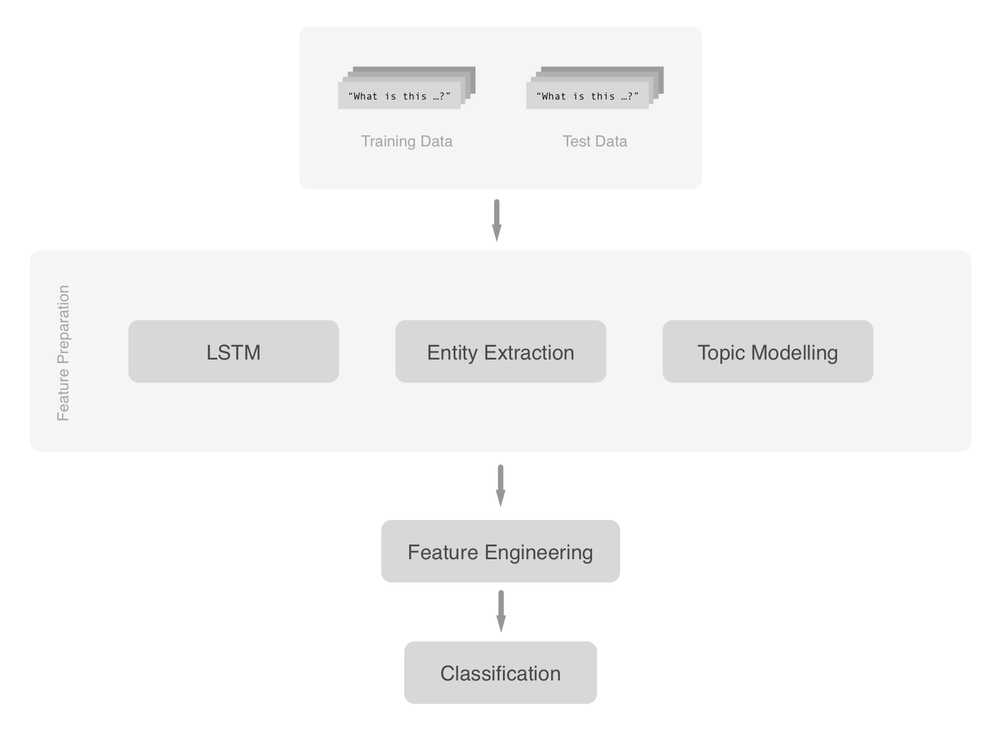

# Siamese Network Question Pair Classifier

* [Usage](https://github.com/enzoblindow/aml-kaggle#usage)
* [Requirements](https://github.com/enzoblindow/aml-kaggle#requirements)

## Usage
All pieces of the pipeline are written in several iPython notebooks all located in the `/notebooks/` directory. Below graphic indicates how to run the notebooks to fully run a training or test cycle. Please make sure that the data files are named correspondingly.

### Pipeline

### Data
All data is placed in `./data/` test and training data is best named `train_labels.csv`, `train_data.csv`, and `test_data.csv`. This way all the notebooks can easily be trained or tested on different data, ensuring a consistent file naming.

### Training
The main piece that would need training is the Siamese LSTM network, to train it run the `/notebooks/lstm_train.ipynb` notebook. Otherwise we already trained a few models with varying hyperparameters and architectures, which you can load with the `load_model` method found in `helpers.py`.

## Requirements
* run `pip install -r pip-requirements.txt` in the projects directory
* download [gloVe embeddings](http://nlp.stanford.edu/data/glove.6B.zip) and place the file `glove.6B.300d.txt` in projects directory
* if not installed, please run `python -m spacy download en` and `python -m spacy download en_core_web_lg` to install spaCy english corpus and word embeddings

